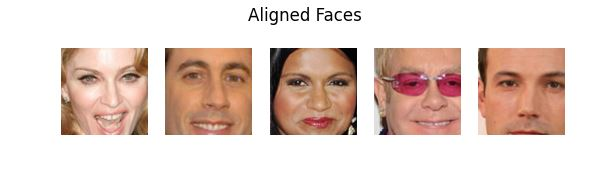

# Face recognition using dlib and knn :raising_hand_man:
A light weight example demonstrates facial recognition with dlib. The code is based on [dlib](http://dlib.net/) official examples and [How to Develop a Face Recognition System Using FaceNet in Keras](https://machinelearningmastery.com/how-to-develop-a-face-recognition-system-using-facenet-in-keras-and-an-svm-classifier/) tutorial

The dataset used in this project is made by [Dan Becker](https://www.linkedin.com/in/dansbecker/) and is [available on Kaggle](https://www.kaggle.com/dansbecker/5-celebrity-faces-dataset). (a Kaggle account is required to download the dataset)



## Usage
1. Clone this repository
```
git clone https://github.com/iceman126/face-recognition
```
2. Install dlib
```
Download the source code from dlib website
cd dlib/directory
python setup.py install
```
3. Run the code
```
python create_face_embeddings.py   # create embeddings
python train_model_and_predict.py
```

## About me
Feel free to add me as a linkedin connection. :point_right:[Link](www.linkedin.com/in/jinbo-huang):point_left:

If you think this repo is helpful to you, you can show your support by giving it a :star:!
